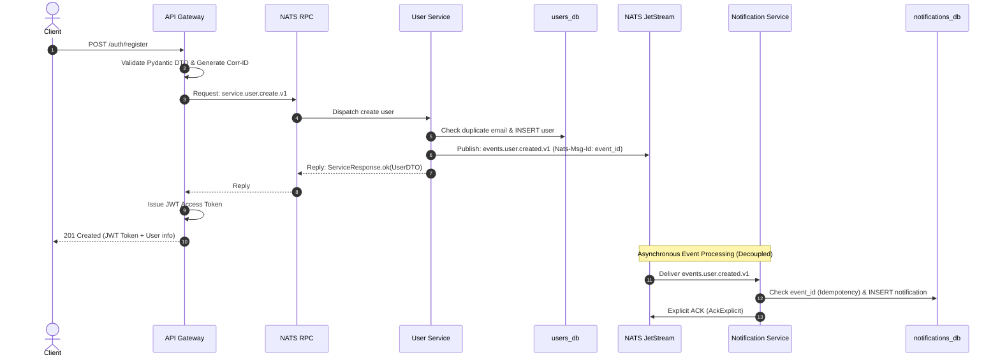

# Architecture & System Design Documentation

This document describes the high-level architecture, design decisions, data flows, failure semantics, and security model of the **Event-Driven Microservices Platform**.

---

## 1. System Overview

The platform is designed around **decoupled, autonomous microservices**, **database-per-service isolation**, and **asynchronous event-driven messaging** orchestrated with **FastAPI**, **PostgreSQL**, and **NATS JetStream**.

### Core Tenet: Zero Direct Service-to-Service HTTP Calls
Neither the User Service nor the Notification Service exposes direct HTTP endpoints to each other, nor do they communicate via WebSockets. All inter-service communications occur over:
1. **NATS Request/Reply (RPC)**: Synchronous commands and queries routed from the API Gateway to internal backend services.
2. **NATS JetStream (Event Streaming)**: Durable, asynchronous publish/subscribe domain events distributed to independent worker consumers.

```mermaid
flowchart TD
    Client["Client / Frontend"] -->|HTTP / REST (JWT Auth)| Gateway["API Gateway (Port 8000)"]
    
    subgraph Internal_Network["Private Microservices Network (Docker / VPC)"]
        Gateway -->|NATS RPC (service.user.*)| UserService["User Service"]
        Gateway -->|NATS RPC (service.notification.*)| NotifService["Notification Service"]
        
        UserService -->|Publishes Event: events.user.created.v1| NATS_JS[("NATS JetStream (USER_EVENTS Stream)")]
        
        NATS_JS -->|Durable Push/Pull with Explicit ACK| NotifService
        
        UserService --- UserDB[("PostgreSQL: users_db")]
        NotifService --- NotifDB[("PostgreSQL: notifications_db")]
    end
```

---

## 2. Component Responsibilities

| Component | Technology | Primary Responsibilities | Data Store |
| :--- | :--- | :--- | :--- |
| **API Gateway** | FastAPI, Uvicorn, PyJWT | • Public entry point<br>• JWT authentication & token issuance<br>• Request validation (Pydantic v2)<br>• Rate limiting & correlation ID injection<br>• Downstream routing via NATS RPC | *Stateless* |
| **User Service** | FastAPI, SQLAlchemy 2.x (asyncpg) | • User registration & profile management<br>• Secure password hashing (Bcrypt)<br>• Database persistence in `users_db`<br>• Publishing `UserCreatedEventV1` to JetStream | `users_db` (PostgreSQL) |
| **Notification Service** | FastAPI, SQLAlchemy 2.x (asyncpg), JetStream Consumer | • Consumes `events.user.created.v1`<br>• Idempotent event deduplication via `event_id`<br>• Creates welcome notification records<br>• Serves notification queries via NATS RPC | `notifications_db` (PostgreSQL) |
| **Message Broker** | NATS Server + JetStream | • Low-latency RPC routing<br>• Persistent, replayable stream storage (`USER_EVENTS`)<br>• Durable consumer state tracking and ACK management | File / Memory JetStream Storage |

---

## 3. Communication & Message Flows

### A. User Registration Flow (Synchronous RPC + Asynchronous Event)
1. **Client** issues `POST /auth/register` with credentials to **API Gateway**.
2. **Gateway** validates input with Pydantic, generates `correlation_id`, and issues a NATS RPC request on subject `service.user.create.v1`.
3. **User Service** verifies email uniqueness, hashes password with `bcrypt` (cost 12), and writes record to `users_db`.
4. **User Service** publishes `UserCreatedEventV1` to JetStream subject `events.user.created.v1`.
5. **User Service** responds via NATS reply subject with created user data.
6. **Gateway** receives RPC response, generates signed JWT access token, and responds to client with `201 Created`.
7. *Concurrently & Asynchronously*: **Notification Service** consumes the event from JetStream, checks idempotency table, saves notification in `notifications_db`, and ACKs the message.



---

## 4. NATS JetStream & Event Architecture

### Stream Configuration
- **Stream Name**: `USER_EVENTS`
- **Subjects**: `events.user.>`
- **Storage Type**: `File` (durable disk persistence)
- **Retention Policy**: `Limits`

### Durable Consumer Configuration
- **Consumer Name**: `notification-service-user-created`
- **Filter Subject**: `events.user.created.v1`
- **Deliver Policy**: `DeliverAll` (replays all unprocessed messages upon reconnection)
- **Ack Policy**: `AckExplicit` (message is only marked delivered after application explicitly ACKs)
- **Ack Wait**: `10 seconds` (if no ACK received within 10s, message is re-delivered)
- **Max Deliveries**: `3 attempts` (prevents poison pills from stalling stream processing)

---

## 5. Database Isolation & Idempotency

### Strict Database-per-Service
- **User Service** connects only to `users_db`.
- **Notification Service** connects only to `notifications_db`.
- No cross-database foreign keys, joins, or shared database credentials exist.

### Idempotent Consumer Design
In distributed systems, networks can drop ACKs, causing JetStream to redeliver a message that was already processed (**at-least-once delivery**).

To guarantee **exactly-once processing semantics** at the application layer:
1. Every domain event generates a globally unique `event_id: UUID`.
2. The `notifications` table maintains a `UNIQUE` constraint and index on `event_id`:
   ```sql
   event_id UUID UNIQUE NOT NULL
   ```
3. Before writing a notification, `NotificationService` executes:
   ```python
   existing = await repo.get_by_event_id(event.event_id)
   if existing:
       logger.info(f"Idempotency hit: Event {event.event_id} already processed. Skipping.")
       return existing
   ```
4. If a duplicate event arrives (e.g., during network replay), the service acknowledges the message immediately without generating duplicate notifications.

---

## 6. Resilience & Failure Handling

| Failure Scenario | Mitigation & Architecture Behavior |
| :--- | :--- |
| **Notification Service Crashes** | JetStream safely buffers `UserCreatedEventV1` messages in durable file storage. User registration continues without disruption. When Notification Service restarts, the durable consumer resumes from its last unacknowledged sequence. |
| **NATS Broker Temporary Disconnect** | `NATSManager` uses automatic exponential backoff reconnection (`max_reconnect_attempts: -1`). |
| **Downstream RPC Timeout** | API Gateway catches NATS `TimeoutError` and returns `504 Gateway Timeout` with a correlation ID, protecting clients from hanging sockets. |
| **Poison Pill Message (Malformed Event)** | If message processing fails consecutively up to `max_deliver` (3 attempts), the consumer executes `msg.term()` to route the message away from blocking the stream, logging the incident with full error context. |
| **Database Failure during Event Handling** | Consumer rejects the message with `msg.nak(delay=2)`, signaling JetStream to redeliver after a short delay once DB recovers. |

---

## 7. Security Model

1. **Edge-Only Exposure**: Only the API Gateway exposes port 8000 to the external network. Backend microservices (`user-service:8001`, `notification-service:8002`, `postgres:5432`, `nats:4222`) run exclusively on the private Docker bridge network (`microservices-net`).
2. **Cryptographic Password Hashing**: Passwords are never stored in plaintext. Passwords are salted and hashed using `bcrypt` (12 rounds) inside the User Service.
3. **JWT Authentication**:
   - Algorithm: `HS256`
   - Payload: `sub` (User UUID), `email`, `iat`, `exp`.
   - Expiration: Configurable (default 60 minutes).
4. **NATS Authentication**: NATS requires username/password authentication configured via environment variables.
5. **No Secret Leakage**: Stack traces and internal exception messages are caught at the Gateway layer and sanitized before returning client JSON envelopes.

---

## 8. Scalability & Future Improvements

- **Horizontal Scaling**: API Gateway, User Service, and Notification Service are completely stateless application processes. Multiple replicas can run behind a load balancer.
- **Queue Groups for JetStream**: Notification Service can use NATS Queue Groups (`queue="notification-workers"`) to distribute event processing across multiple worker pods concurrently.
- **Outbox Pattern**: In high-throughput mission-critical banking environments, the Transactional Outbox Pattern can be integrated with PostgreSQL and Debezium/NATS CDC for dual-write safety.
- **Distributed Tracing**: OpenTelemetry can be seamlessly layered on top of the existing `correlation_id` propagation headers.
